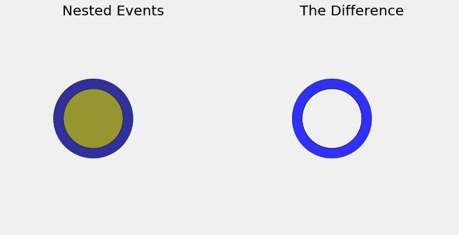
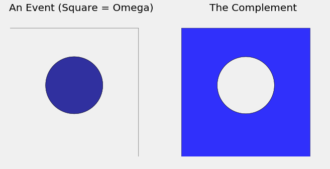

## Addition

The third axiom is about events that are *mutually exclusive*. Informally, two events $A$ and $B$ are mutually exclusive if at most one of them can happen; in other words, they can't both happen. 

For example, suppose you are selecting one student at random from a class in which 40% of the students are freshmen and 20% are sophomores. Each student is either a freshman or a sophomore or neither; but no student is both a freshman and a sophomore. So if $A$ is the event "the student selected is a freshman" and $B$ is the event "the student selected is a sophomore", then $A$ and $B$ are mutually exclusive.

What's the big deal about mutually exclusive events? To understand this, start by thinking about the event that the selected student is a freshman or a sophomore. In the language of set theory, that's the *union* of the two events "freshman" and "sophomore". It is a great idea to use Venn diagrams to visualize events. In the diagram below, imagine $A$ and $B$ to be two mutually exclusive events shown as blue and gold circles. Because the events are mutually exclusive, the corresponding circles don't overlap. The union is the set of all the points in the two circles.

What's the chance that the student is a freshman or a sophomore? In the population, 40% are freshmen and 20% are sophomores, so a natural answer is 60%. That's the percent of students who satisfy our criterion of "freshman or sophomore". The simple addition works because the two groups are disjoint.

Kolmogorov used this idea to formulate the third and most important axiom of probability. Formally, $A$ and $B$ are mutually exclusive events if their intersection is empty:
$$
A \cap B = \phi
$$

#### The Third Axiom: Addition Rule
In the context of finite outcome spaces, the axiom says:

- If $A$ and $B$ are mutually exclusive events, then $P(A \cup B) = P(A) + P(B)$.

You will show in an exercise that the axiom implies something more general:

- For any fixed $n$, if $A_1, A_2, \ldots, A_n$ are mutually exclusive (that is, if $A_i \cap A_j = \phi$ for all $i \ne j$), then
$$
P\big{(} \bigcup_{i=1}^n A_i \big{)} = \sum_{i=1}^n P(A_i)
$$ 
This is sometimes called the axiom of *finite additivity*.

This deceptively simple axiom has tremendous power, especially when it is extended to account for infinitely many mutually exclusive events. For a start, it can be used to create some handy computational tools.

### Nested Events
Suppose that 50% of the students in a class have Data Science as one of their majors, and 40% are majoring in Data Science as well as Computer Science (CS). If you pick a student at random, what is the chance that the student is majoring in Data Science but not in CS?

The Venn diagram below shows a dark blue circle corresponding to the event $A =$ "Data Science as one of the majors", and a gold circle (not drawn to scale) corresponding $B =$ "majoring in both Data Science and CS". The two events are *nested* because $B$ is a subset of $A$: everyone in $B$ has Data Science as one of their majors.

So $B \subseteq A$, and those who are majoring in Data Science but not CS is the *difference* "$A$ and not $B$":
$$
A \backslash B = A \cap B^c
$$
where $B^c$ is the complement of $B$. The difference is the bright blue ring on the right.

What's the chance that the student is in the bright blue difference? If you answered, "50% - 40% = 10%", you are right, and it's great that your intuition is saying that probabilities behave just like areas. They do. In fact the calculation follows from the axiom of additivity, which we also motivated by looking at areas.

#### Difference Rule
Suppose $A$ and $B$ are events such that $B \subseteq A$. Then $P(A \backslash B) = P(A) - P(B)$.

**Proof.** Because $B \subseteq A$, 
$$
A = B \cup (A \backslash B)
$$
which is a disjoint union. By the axiom of additivity,
$$
P(A) = P(B) + P(A \backslash B)
$$
and so
$$
P(A \backslash B) = P(A) - P(B)
$$

### The Complement
If an event has chance 40%, what's the chance that it doesn't happen? The "obvious" answer of 60% is a special case of the difference rule.

#### Complement Rule
For any event $B$, $P(B^c) = 1 - P(B)$.

**Proof.** The Venn diagram below shows what to do. Take $A = \Omega$ in the formula for the difference, and remember the second axiom $P(\Omega) = 1$. Alternatively, redo the argument for the difference rule in this special case.

When you see a minus sign in a calculation of probabilities, as in the Complement Rule above, you will often find that the minus sign is due to a rearrangement of terms in an application of the addition rule.

When you add or subtract probabilities, you are implicitly splitting an event into disjoint pieces. This is called *partitioning* the event, a fundamentally important technique to master. In the subsequent sections you will see numerous uses of partitioning.
